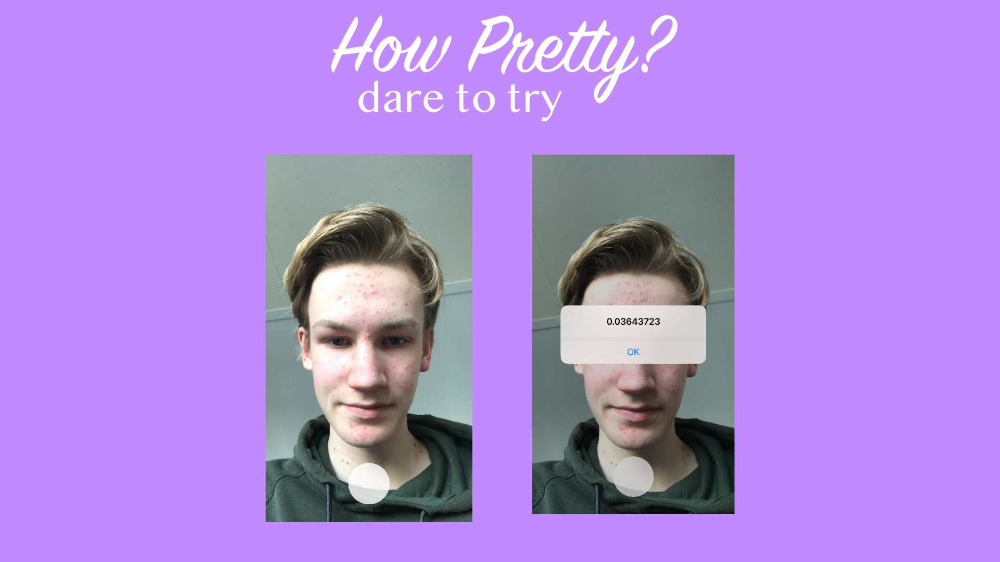

# HowPretty

The most brutal app in human history. This app takes a picture of your face and scores it from 0 to 1 where 1 is the most attractive.

 I'm not very pretty according to the app.

**IMPORTANT NOTICE: THIS APP IS A JOKE AND SHOULD BE REGARDED AS SUCH. PRETTINESS IS SUBJECTIVE AND THE OUTPUT OF THIS APP SHOULD NOT BE TAKEN SERIOUSLY.**

## Building HowPretty

1. I started looking for a dataset which has images of faces along with labels for attractiveness. I used a subset of [this dataset](http://mmlab.ie.cuhk.edu.hk/projects/CelebA.html).
   * Many images.
   * Many labels.
   * Publicly available without registration.
2. I built and trained a model using TensorFlow 2 and Keras on Google Colab. You can view the model [here](https://colab.research.google.com/drive/1AySxSOlXwWGHTEWy6Uvugia-n3SvCi1P#scrollTo=jsHFf5zag7mu). I also exported the model to a `.tflite` file which can be found [here](https://github.com/rickwierenga/HowPretty/blob/master/HowPretty/model.tflite).
   * [MobileNet](https://arxiv.org/abs/1704.04861) for fast inference on mobile devices.
   * Used binary classification because there is only one class.
   * Trained the model only on input images and not other aspects because we don't have access to those at inference time.
3. I built a simple app which has a camera layer. See [#b2c17cf](https://github.com/rickwierenga/HowPretty/commit/b2c17cf756af49413b0130ba11309262bea0bb84).
   * Reused the code I've written for this [tutorial](https://heartbeat.fritz.ai/building-a-barcode-scanner-in-swift-on-ios-9ad550e8f78b) with corresponding [code](https://github.com/rickwierenga/heartbeat-tutorials/tree/master/BarcodeScanner). This code includes a camera layer and a shutter button.
   * Changed the code to use the FaceTime HD camera instead of the Camera.
4. I followed the [TensorFlow lite iOS guide](https://firebase.google.com/docs/ml-kit/ios/use-custom-models?hl=en) and added the model to my app. 
    * I chose to use a local model to preserve the users privacy.
    
_HowPretty_ works with the newest version of iOS 13.3.

## Improvements
Currently _HowPretty_ is an MVP. There are a couple of things that could be improved if this app goes into production:

- [ ] Add a nicer score UI. For example, add a label or "progress bar" for scores instead of an alert.
- [ ] Retrain the model on the full set of images instead of a subset.
- [ ] Add a loading screen.
- [ ] Design an app icon.
- [ ] Add an Android version.
- [ ] Use bounding boxes of face to crop the image for higher accuracy. Tell the user to move closer or further away to get the perfect resolution (150 by 150).
- [ ] Use bounding boxes of face to crop the image for higher accuracy. Tell the user to move closer or further away to get the perfect resolution (150 by 150).
- [ ] Add a share buttons which shares the image, score and a link to the app.

---
&copy;Rick Wierenga
